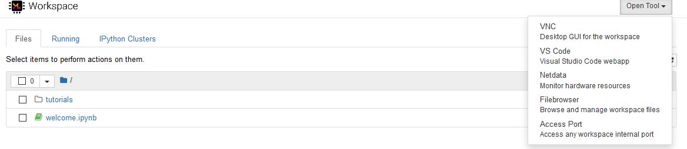
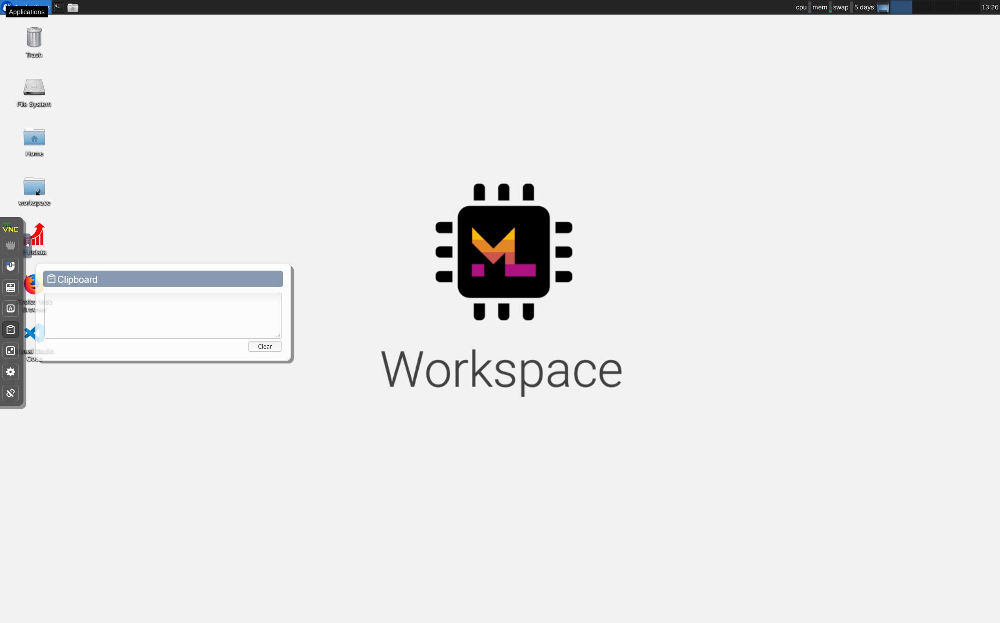

# Virtual Desktop

A Virtual Desktop is available from the ML Workspaces Jupyter image.  

A solution for clipboard transfer is available. Text copied in the remote desktop will appear in the clipboard box in the Virtual Desktop interface. You can then copy the text from that box to access it in your local clipboard. Any text put into the clipboard box will be sent to the remote clipboard as well. 

